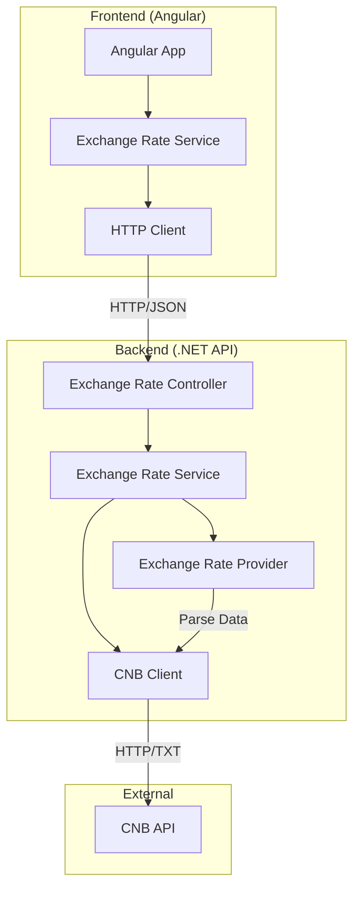

# Design Document: Exchange Rate Display

## Overview

The Exchange Rate Display system is a fullstack application that retrieves current exchange rates from the Czech National Bank (CNB), exposes them through a .NET Web API, and displays them in an Angular web application. The system demonstrates modern web development practices including clean architecture, proper error handling, and responsive UI design.

The application follows a three-tier architecture:
1. **Data Layer**: CNB API integration for fetching exchange rate data
2. **API Layer**: .NET Web API that processes and exposes exchange rate endpoints
3. **Presentation Layer**: Angular SPA that consumes the API and displays data

## Architecture



## Components and Interfaces

### Backend Components

#### ExchangeRateProvider
**Responsibility**: Fetch and parse exchange rate data from CNB API
**Key Methods**:
- `GetCurrentRatesAsync()`: Retrieves current exchange rates
- `ParseCnbData(string data)`: Parses CNB TXT format into structured objects

#### ExchangeRateController
**Responsibility**: Expose REST endpoints for exchange rate data
**Endpoints**:
- `GET /api/exchangerates`: Returns current exchange rates in JSON format

#### ExchangeRateService
**Responsibility**: Business logic layer between controller and data provider
**Key Methods**:
- `GetExchangeRatesAsync()`: Orchestrates data retrieval and error handling

#### CnbClient
**Responsibility**: HTTP client wrapper for CNB API communication
**Key Methods**:
- `FetchRatesAsync(DateTime? date)`: Makes HTTP requests to CNB endpoints

### Frontend Components

#### ExchangeRateComponent
**Responsibility**: Main component for displaying exchange rates
**Features**:
- Table display of exchange rates
- Loading states
- Error handling and user feedback

#### ExchangeRateService (Angular)
**Responsibility**: HTTP communication with backend API
**Key Methods**:
- `getExchangeRates()`: Fetches data from .NET API
- Error handling and retry logic

## Data Models

### ExchangeRate Model
```csharp
public class ExchangeRate
{
    public string Country { get; set; }
    public string Currency { get; set; }
    public int Amount { get; set; }
    public string Code { get; set; }
    public decimal Rate { get; set; }
}
```

### ExchangeRateResponse Model
```csharp
public class ExchangeRateResponse
{
    public DateTime Date { get; set; }
    public int SequenceNumber { get; set; }
    public List<ExchangeRate> Rates { get; set; }
}
```

### CNB Data Format
The CNB API returns data in pipe-delimited TXT format:
```
03.Jan.2000 #1
Country|Currency|Amount|Code|Rate
Australia|dollar|1|AUD|23.282
USA|dollar|1|USD|25.347
```

## Correctness Properties

*A property is a characteristic or behavior that should hold true across all valid executions of a system-essentially, a formal statement about what the system should do. Properties serve as the bridge between human-readable specifications and machine-verifiable correctness guarantees.*

After reviewing the prework analysis, I've identified several redundant properties that can be consolidated:

**Property Reflection:**
- Properties 1.1 and 1.2 both test CNB API connectivity and can be combined into one comprehensive property
- Properties 2.4 and 5.1 both test error handling with HTTP status codes and can be consolidated
- Properties 3.4 and 3.5 both test UI state management and can be combined
- Properties 4.1, 4.2, and 4.4 all test configuration management and can be consolidated

**Consolidated Properties:**

**Property 1: CNB Data Retrieval**
*For any* valid date, when the ExchangeRateProvider requests data from CNB, it should successfully retrieve and parse exchange rate data containing all required fields (country, currency, amount, code, rate)
**Validates: Requirements 1.1, 1.2, 1.3, 1.5**

**Property 2: CNB Data Parsing Round Trip**
*For any* valid CNB TXT format data, parsing then formatting should preserve the essential exchange rate information
**Validates: Requirements 1.3**

**Property 3: Error Handling Consistency**
*For any* network failure or invalid data scenario, the system should handle errors gracefully by returning appropriate HTTP status codes (503 for CNB unavailability) and logging errors appropriately
**Validates: Requirements 1.4, 2.4, 5.1, 5.2, 5.4**

**Property 4: API Response Format**
*For any* successful API request, the Backend_API should return data in valid JSON format with correct content-type headers
**Validates: Requirements 2.1, 2.2**

**Property 5: CORS Configuration**
*For any* cross-origin request from the Angular frontend, the Backend_API should include appropriate CORS headers to allow access
**Validates: Requirements 2.5**

**Property 6: Frontend Data Display**
*For any* exchange rate data received from the API, the Frontend_App should display all required fields (currency code, rate, amount, country) in a readable table format
**Validates: Requirements 3.1, 3.3**

**Property 7: Frontend HTTP Integration**
*For any* component initialization, the Frontend_App should make HTTP requests to the Backend_API using the configured endpoint URL
**Validates: Requirements 3.2**

**Property 8: UI State Management**
*For any* async operation (loading data or handling errors), the Frontend_App should display appropriate UI feedback (loading indicators during requests, error messages on failures)
**Validates: Requirements 3.4, 3.5, 5.3, 5.5**

**Property 9: Configuration Management**
*For any* environment deployment, the system should read all URLs from configuration sources (environment variables or config files) and contain no hardcoded URLs in source code
**Validates: Requirements 4.1, 4.2, 4.3, 4.4**

**Property 10: REST API Conventions**
*For any* API endpoint, it should follow standard REST conventions including appropriate HTTP verbs, resource naming, and status codes
**Validates: Requirements 6.2**

<function_calls>
<invoke name="prework">
<parameter name="featureName">exchange-rate-display

## Error Handling

### Backend Error Handling
- **CNB API Failures**: Return HTTP 503 Service Unavailable when CNB is unreachable
- **Data Parsing Errors**: Log detailed error information and return HTTP 500 Internal Server Error
- **Invalid Requests**: Return HTTP 400 Bad Request for malformed requests
- **Timeout Handling**: Implement configurable timeouts for CNB API calls

### Frontend Error Handling
- **Network Errors**: Display user-friendly messages for connection issues
- **API Errors**: Show specific error messages based on HTTP status codes
- **Loading States**: Provide visual feedback during async operations
- **Retry Logic**: Allow users to retry failed operations

### Logging Strategy
- **Structured Logging**: Use structured logging with correlation IDs
- **Error Levels**: Appropriate log levels (Error, Warning, Information)
- **Sensitive Data**: Avoid logging sensitive information
- **Performance Metrics**: Log response times and success rates

## Testing Strategy

### Property-Based Testing
The system will use property-based testing to verify universal correctness properties across many generated inputs. Each property test will run a minimum of 100 iterations to ensure comprehensive coverage.

**Testing Framework**: 
- Backend: xUnit with FsCheck for .NET property-based testing
- Frontend: Jasmine/Karma with fast-check for TypeScript property-based testing

**Property Test Configuration**:
- Minimum 100 iterations per property test
- Each test tagged with format: **Feature: exchange-rate-display, Property {number}: {property_text}**
- Properties validate requirements as specified in the Correctness Properties section

### Unit Testing
Unit tests complement property tests by focusing on specific examples, edge cases, and integration points:

**Backend Unit Tests**:
- ExchangeRateProvider parsing logic with sample CNB data
- Controller endpoint behavior with mock dependencies
- Error handling scenarios with specific error conditions
- Configuration loading and validation

**Frontend Unit Tests**:
- Component rendering with mock data
- Service HTTP communication with mock responses
- Error handling with simulated failures
- User interaction scenarios

### Integration Testing
- End-to-end API testing with real CNB data
- Frontend-backend integration testing
- CORS configuration validation
- Configuration management across environments

### Test Organization
- Co-locate tests with source files using `.test.cs` and `.spec.ts` suffixes
- Separate unit tests from integration tests
- Use descriptive test names that explain the scenario being tested
- Mock external dependencies (CNB API) for reliable unit testing