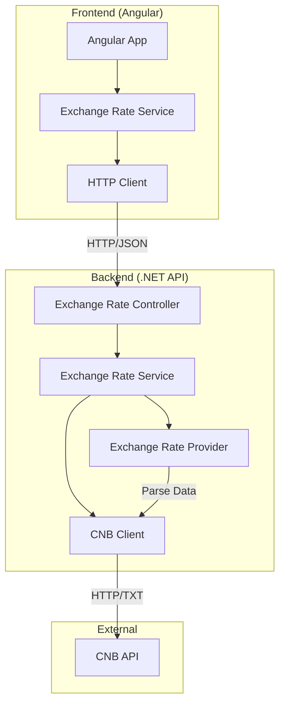

# Exchange Rate Display Application

A fullstack application that retrieves exchange rate data from the Czech National Bank (CNB), exposes it through a .NET Web API, and displays it in an Angular web application. The system demonstrates modern web development practices including clean architecture, proper error handling, and responsive UI design.

## Table of Contents

- [Prerequisites](#prerequisites)
- [Quick Start](#quick-start)
- [Project Structure](#project-structure)
- [Setup Instructions](#setup-instructions)
- [Configuration](#configuration)
- [Environment Variables](#environment-variables)
- [Development](#development)
- [Testing](#testing)
- [Building for Production](#building-for-production)
- [Deployment](#deployment)
- [Docker Deployment](#docker-deployment)
- [API Documentation](#api-documentation)
- [Architecture](#architecture)
- [Troubleshooting](#troubleshooting)
- [Performance Considerations](#performance-considerations)
- [Security](#security)
- [Contributing](#contributing)
- [License](#license)

## Prerequisites

Before you begin, ensure you have the following installed on your system:

### Required Software
- **[.NET 9.0 SDK](https://dotnet.microsoft.com/download/dotnet/9.0)** - For building and running the backend API
- **[Node.js](https://nodejs.org/)** (version 18 or higher) - For building and running the Angular frontend
- **[Angular CLI](https://angular.io/cli)** - Install globally with `npm install -g @angular/cli`

### Optional Tools
- **[Visual Studio](https://visualstudio.microsoft.com/)** or **[Visual Studio Code](https://code.visualstudio.com/)** - For development
- **[Git](https://git-scm.com/)** - For version control
- **[Docker](https://www.docker.com/)** - For containerized deployment (optional)

### System Requirements
- **Operating System**: Windows 10+, macOS 10.15+, or Linux (Ubuntu 18.04+)
- **Memory**: 4GB RAM minimum, 8GB recommended
- **Disk Space**: 2GB free space for dependencies and build artifacts

## Quick Start

Get the application running in under 5 minutes:

1. **Clone the repository**:
   ```bash
   git clone <repository-url>
   cd exchange-rate-display
   ```

2. **Start the backend**:
   ```bash
   cd backend/ExchangeRateApi
   dotnet restore
   dotnet run
   ```

3. **Start the frontend** (in a new terminal):
   ```bash
   cd frontend/exchange-rate-app
   npm install
   npm run serve:dev
   ```

4. **Open your browser** to `http://localhost:4200`

The application should now be running with the backend API at `http://localhost:5000` and the frontend at `http://localhost:4200`.

## Project Structure

```
exchange-rate-display/
├── backend/                          # .NET Backend
│   ├── ExchangeRateApp.sln          # Visual Studio solution file
│   ├── ExchangeRateApi/              # Main API project
│   │   ├── Controllers/              # API controllers
│   │   ├── Services/                 # Business logic services
│   │   ├── Models/                   # Data models
│   │   ├── Middleware/               # Custom middleware
│   │   ├── appsettings.json          # Base configuration
│   │   ├── appsettings.Development.json
│   │   ├── appsettings.Production.json
│   │   ├── .env.example              # Environment variables template
│   │   ├── CONFIGURATION.md          # Detailed configuration guide
│   │   └── ExchangeRateApi.csproj    # Project file
│   └── ExchangeRateApi.Tests/        # Unit tests
│       ├── Controllers/              # Controller tests
│       └── ExchangeRateApi.Tests.csproj
├── frontend/                         # Angular Frontend
│   └── exchange-rate-app/            # Angular application
│       ├── src/
│       │   ├── app/                  # Application components
│       │   │   ├── components/       # UI components
│       │   │   ├── services/         # Angular services
│       │   │   └── models/           # TypeScript interfaces
│       │   └── environments/         # Environment configurations
│       ├── scripts/                  # Build scripts
│       ├── .env.example              # Environment variables template
│       ├── ENVIRONMENT.md            # Environment configuration guide
│       ├── package.json              # NPM dependencies
│       ├── angular.json              # Angular CLI configuration
│       └── vitest.config.ts          # Testing configuration
├── .kiro/                            # Kiro specifications
│   └── specs/exchange-rate-display/  # Feature specifications
├── README.md                         # This file
└── LICENSE                           # License information
```

## Setup Instructions

### Backend (.NET Web API)

1. **Navigate to the backend directory**:
   ```bash
   cd backend/ExchangeRateApi
   ```

2. **Restore NuGet packages**:
   ```bash
   dotnet restore
   ```

3. **Build the project**:
   ```bash
   dotnet build
   ```

4. **Run the API**:
   ```bash
   dotnet run
   ```

The API will be available at:
- HTTP: `http://localhost:5000`
- HTTPS: `https://localhost:5001`

### Frontend (Angular)

1. **Navigate to the frontend directory**:
   ```bash
   cd frontend/exchange-rate-app
   ```

2. **Install npm packages**:
   ```bash
   npm install
   ```

3. **Build the project**:
   ```bash
   npm run build:dev
   ```

4. **Run the development server**:
   ```bash
   npm run serve:dev
   ```

The Angular application will be available at `http://localhost:4200`.

## Configuration

### Backend Configuration

The backend uses a hierarchical configuration system that loads settings from multiple sources in the following priority order:

1. **Command line arguments** (highest priority)
2. **Environment variables**
3. **appsettings.{Environment}.json files**
4. **appsettings.json** (lowest priority)

#### Configuration Files

| File | Purpose |
|------|---------|
| `appsettings.json` | Base configuration for all environments |
| `appsettings.Development.json` | Development-specific overrides |
| `appsettings.Production.json` | Production-specific overrides |
| `.env.example` | Template for environment variables |

#### Key Configuration Sections

**CNB API Configuration (`CnbApi`)**:
```json
{
  "CnbApi": {
    "BaseUrl": "https://www.cnb.cz/en/financial-markets/foreign-exchange-market/central-bank-exchange-rate-fixing/central-bank-exchange-rate-fixing/",
    "DailyRatesEndpoint": "daily.txt",
    "TimeoutSeconds": 30,
    "MaxRetries": 3,
    "RetryDelayMs": 1000
  }
}
```

**CORS Configuration (`Cors`)**:
```json
{
  "Cors": {
    "AllowedOrigins": ["http://localhost:4200", "https://localhost:4200"]
  }
}
```

#### Environment Variables

Override configuration using environment variables with double underscores (`__`) for nested sections:

```bash
# CNB API Configuration
CNBAPI__BASEURL=https://custom-cnb-api.com/
CNBAPI__TIMEOUTSECONDS=60

# CORS Configuration (array indices)
CORS__ALLOWEDORIGINS__0=https://myapp.com
CORS__ALLOWEDORIGINS__1=https://www.myapp.com

# ASP.NET Core Configuration
ASPNETCORE_ENVIRONMENT=Production
ASPNETCORE_URLS=http://localhost:8080
```

## Environment Variables

The application supports configuration through environment variables for both backend and frontend components.

### Backend Environment Variables

Override configuration using environment variables with double underscores (`__`) for nested sections:

| Variable | Description | Default | Example |
|----------|-------------|---------|---------|
| `ASPNETCORE_ENVIRONMENT` | Runtime environment | `Development` | `Production` |
| `ASPNETCORE_URLS` | Server binding URLs | `http://localhost:5000` | `http://localhost:8080` |
| `CNBAPI__BASEURL` | CNB API base URL | *See appsettings.json* | `https://www.cnb.cz/...` |
| `CNBAPI__TIMEOUTSECONDS` | HTTP request timeout | `30` | `60` |
| `CNBAPI__MAXRETRIES` | Maximum retry attempts | `3` | `5` |
| `CNBAPI__RETRYDELAYMS` | Retry delay in milliseconds | `1000` | `2000` |
| `CORS__ALLOWEDORIGINS__0` | First allowed CORS origin | *See appsettings.json* | `https://myapp.com` |
| `CORS__ALLOWEDORIGINS__1` | Second allowed CORS origin | - | `https://www.myapp.com` |
| `LOGGING__LOGLEVEL__DEFAULT` | Default log level | `Information` | `Warning` |

**Example Backend Configuration:**
```bash
# Windows (Command Prompt)
set ASPNETCORE_ENVIRONMENT=Production
set CNBAPI__TIMEOUTSECONDS=60
set CORS__ALLOWEDORIGINS__0=https://myapp.com

# Windows (PowerShell)
$env:ASPNETCORE_ENVIRONMENT="Production"
$env:CNBAPI__TIMEOUTSECONDS="60"
$env:CORS__ALLOWEDORIGINS__0="https://myapp.com"

# Linux/macOS
export ASPNETCORE_ENVIRONMENT=Production
export CNBAPI__TIMEOUTSECONDS=60
export CORS__ALLOWEDORIGINS__0=https://myapp.com
```

### Frontend Environment Variables

| Variable | Description | Default | Example |
|----------|-------------|---------|---------|
| `API_BASE_URL` | Backend API base URL | Environment-specific | `https://api.myapp.com` |

**Example Frontend Configuration:**
```bash
# Set API URL before building
API_BASE_URL=https://api.myapp.com npm run build:prod

# Or for development
API_BASE_URL=http://localhost:8080/api npm run serve:dev
```

### Environment Files

Both projects include `.env.example` files showing all available configuration options:

- **Backend**: `backend/ExchangeRateApi/.env.example`
- **Frontend**: `frontend/exchange-rate-app/.env.example`

Copy these files to `.env` and customize for your environment:

```bash
# Backend
cp backend/ExchangeRateApi/.env.example backend/ExchangeRateApi/.env

# Frontend  
cp frontend/exchange-rate-app/.env.example frontend/exchange-rate-app/.env
```

## Development

### Running Both Projects Simultaneously

1. **Terminal 1 - Start the backend**:
   ```bash
   cd backend/ExchangeRateApi
   dotnet run
   ```

2. **Terminal 2 - Start the frontend**:
   ```bash
   cd frontend/exchange-rate-app
   npm run serve:dev
   ```

3. **Open your browser** to `http://localhost:4200`

### Development Workflow

1. **Make changes** to backend or frontend code
2. **Backend**: The API will automatically reload on file changes (hot reload)
3. **Frontend**: The Angular dev server will automatically rebuild and refresh the browser
4. **Test your changes** in the browser at `http://localhost:4200`

### Useful Development Commands

#### Backend
```bash
# Run with specific environment
ASPNETCORE_ENVIRONMENT=Development dotnet run

# Run tests
dotnet test

# Watch for changes and rebuild
dotnet watch run
```

#### Frontend
```bash
# Serve with different environments
npm run serve:dev      # Development
npm run serve:staging  # Staging

# Run tests
npm test

# Build and watch for changes
npm run watch
```

## Testing

### Backend Testing

The backend uses **xUnit** for unit testing:

```bash
cd backend/ExchangeRateApi.Tests
dotnet test
```

#### Test Structure
- **Unit Tests**: Test individual components in isolation
- **Integration Tests**: Test API endpoints with real HTTP requests
- **Property-Based Tests**: Test universal properties across many inputs (when implemented)

#### Running Specific Tests
```bash
# Run tests with verbose output
dotnet test --verbosity normal

# Run tests with coverage
dotnet test --collect:"XPlat Code Coverage"

# Run specific test class
dotnet test --filter "ClassName=ExchangeRateControllerTests"
```

### Frontend Testing

The frontend uses **Vitest** for unit testing:

```bash
cd frontend/exchange-rate-app
npm test
```

#### Test Structure
- **Component Tests**: Test Angular components in isolation
- **Service Tests**: Test Angular services and HTTP communication
- **Integration Tests**: Test component-service interactions

#### Running Specific Tests
```bash
# Run tests in watch mode
npm run test:watch

# Run tests with coverage
npm run test:coverage

# Run specific test file
npm test -- exchange-rate.component.spec.ts
```

## Building for Production

### Backend Production Build

```bash
cd backend/ExchangeRateApi

# Build for release
dotnet build -c Release

# Publish for deployment
dotnet publish -c Release -o ./publish

# The published files will be in the ./publish directory
```

### Frontend Production Build

```bash
cd frontend/exchange-rate-app

# Build for production
npm run build:prod

# The built files will be in the ./dist directory
```

#### Build Optimization

The production build includes:
- **Code minification** and **tree shaking**
- **Bundle optimization** and **compression**
- **Source map generation** for debugging
- **Asset optimization** (images, fonts, etc.)

## Docker Deployment

The application includes Docker support for easy deployment and development.

### Quick Docker Start

```bash
# Build and start all services
docker-compose up --build

# Run in background
docker-compose up --build -d

# View logs
docker-compose logs -f

# Stop services
docker-compose down
```

### Docker Services

The `docker-compose.yml` file defines two services:

- **api**: .NET Web API backend (port 5000)
- **web**: Angular frontend (port 4200)

### Production Docker Deployment

1. **Create production override file** (`docker-compose.prod.yml`):
   ```yaml
   version: '3.8'
   services:
     api:
       environment:
         - ASPNETCORE_ENVIRONMENT=Production
         - CNBAPI__TIMEOUTSECONDS=120
         - CORS__ALLOWEDORIGINS__0=https://yourdomain.com
       ports:
         - "80:8080"
     
     web:
       build:
         args:
           - API_BASE_URL=https://api.yourdomain.com
       ports:
         - "443:8080"
   ```

2. **Deploy with production configuration**:
   ```bash
   docker-compose -f docker-compose.yml -f docker-compose.prod.yml up --build -d
   ```

### Docker Health Checks

Both services include health checks:
- **Backend**: Checks `/api/exchangerates` endpoint
- **Frontend**: Checks root URL availability

Monitor health status:
```bash
docker ps  # Shows health status
docker inspect --format='{{json .State.Health}}' container-name
```

### Individual Container Builds

Build containers separately if needed:

```bash
# Backend only
docker build -t exchange-rate-api ./backend/ExchangeRateApi

# Frontend only  
docker build -t exchange-rate-web ./frontend/exchange-rate-app

# Run individually
docker run -p 5000:8080 exchange-rate-api
docker run -p 4200:8080 exchange-rate-web
```

## Deployment

For comprehensive deployment instructions including cloud platforms, see [DEPLOYMENT.md](DEPLOYMENT.md).

### Local Production Deployment

#### Backend Deployment

1. **Build for production**:
   ```bash
   cd backend/ExchangeRateApi
   dotnet publish -c Release -o ./publish
   ```

2. **Run published application**:
   ```bash
   cd publish
   dotnet ExchangeRateApi.dll
   ```

#### Frontend Deployment

1. **Build for production**:
   ```bash
   cd frontend/exchange-rate-app
   API_BASE_URL=https://api.yourdomain.com npm run build:prod
   ```

2. **Serve static files**:
   ```bash
   # Using a simple HTTP server
   npx http-server dist/exchange-rate-app -p 4200
   
   # Or copy to web server directory
   cp -r dist/exchange-rate-app/* /var/www/html/
   ```

### Deployment Verification

Both projects include verification scripts:

```bash
# Backend verification
cd backend/ExchangeRateApi
./verify-deployment.ps1

# Frontend verification  
cd frontend/exchange-rate-app
./verify-deployment.ps1
```

These scripts check:
- Build artifacts exist
- Configuration is valid
- Dependencies are available
- Services start correctly

## API Documentation

### Endpoints

#### GET /api/exchangerates

Retrieves current exchange rates from the Czech National Bank.

**Response Format**:
```json
{
  "date": "2024-01-15T00:00:00Z",
  "sequenceNumber": 10,
  "rates": [
    {
      "country": "Australia",
      "currency": "dollar",
      "amount": 1,
      "code": "AUD",
      "rate": 15.234
    }
  ]
}
```

**HTTP Status Codes**:
- `200 OK` - Successfully retrieved exchange rates
- `503 Service Unavailable` - CNB API is temporarily unavailable
- `500 Internal Server Error` - Server error occurred

**Example Usage**:
```bash
# Using curl
curl -X GET "http://localhost:5000/api/exchangerates" \
     -H "Accept: application/json"

# Using PowerShell
Invoke-RestMethod -Uri "http://localhost:5000/api/exchangerates" -Method Get
```

### Error Responses

All error responses follow a consistent format:

```json
{
  "error": "Service Unavailable",
  "message": "The CNB API is currently unavailable. Please try again later.",
  "timestamp": "2024-01-15T10:30:00Z"
}
```

## Architecture

The application follows a **three-tier architecture** with clear separation of concerns:



### Architecture Layers

1. **Presentation Layer (Angular)**:
   - User interface components
   - HTTP communication services
   - State management and error handling

2. **API Layer (.NET Web API)**:
   - RESTful endpoints
   - Business logic orchestration
   - Authentication and authorization (future)

3. **Data Layer**:
   - External API integration (CNB)
   - Data parsing and transformation
   - Caching and persistence (future)

### Key Design Patterns

- **Dependency Injection**: Loose coupling between components
- **Repository Pattern**: Abstraction over data access
- **Service Layer**: Business logic separation
- **Observer Pattern**: Reactive programming with RxJS

## Troubleshooting

### Common Issues and Solutions

#### Backend Issues

**Issue**: `dotnet run` fails with "Unable to bind to http://localhost:5000"
```bash
# Solution: Check if port is in use
netstat -ano | findstr :5000

# Or use a different port
dotnet run --urls "http://localhost:5001"
```

**Issue**: CNB API returns 503 Service Unavailable
```bash
# Solution: Check CNB API status and configuration
# Verify the BaseUrl in appsettings.json
# Check network connectivity
curl -I https://www.cnb.cz/en/financial-markets/foreign-exchange-market/central-bank-exchange-rate-fixing/central-bank-exchange-rate-fixing/daily.txt
```

**Issue**: CORS errors when accessing from frontend
```json
// Solution: Update CORS configuration in appsettings.json
{
  "Cors": {
    "AllowedOrigins": ["http://localhost:4200", "https://localhost:4200"]
  }
}
```

**Issue**: Application fails to start with configuration errors
```bash
# Solution: Check environment variables and configuration files
# Verify required settings are present
dotnet run --verbosity diagnostic
```

#### Frontend Issues

**Issue**: `npm install` fails with permission errors
```bash
# Solution: Use npm with --no-optional flag or fix permissions
npm install --no-optional

# Or on Windows, run as administrator
# On Mac/Linux, fix npm permissions:
sudo chown -R $(whoami) ~/.npm
```

**Issue**: Angular dev server fails to start
```bash
# Solution: Clear npm cache and reinstall
npm cache clean --force
rm -rf node_modules package-lock.json
npm install
```

**Issue**: API calls return 404 Not Found
```typescript
// Solution: Check environment configuration
// Verify API_BASE_URL in environment files
console.log('API Base URL:', environment.apiBaseUrl);
```

**Issue**: Build fails with TypeScript errors
```bash
# Solution: Check TypeScript version compatibility
npm list typescript
npm install typescript@~5.9.2
```

#### Build Issues

**Issue**: Backend build fails with missing dependencies
```bash
# Solution: Restore packages and clean build
dotnet clean
dotnet restore
dotnet build
```

**Issue**: Frontend build fails with memory issues
```bash
# Solution: Increase Node.js memory limit
export NODE_OPTIONS="--max-old-space-size=4096"
npm run build:prod
```

#### Docker Issues

**Issue**: Docker build fails with network errors
```bash
# Solution: Check Docker network and proxy settings
docker build --no-cache --progress=plain .
```

**Issue**: Container fails to start
```bash
# Solution: Check logs and environment variables
docker logs container-name
docker inspect container-name
```

### Debugging Tips

1. **Enable detailed logging** in appsettings.Development.json:
   ```json
   {
     "Logging": {
       "LogLevel": {
         "Default": "Debug",
         "Microsoft.AspNetCore": "Information"
       }
     }
   }
   ```

2. **Use browser developer tools** to inspect network requests and console errors

3. **Check application logs** for detailed error information

4. **Verify environment variables** are set correctly:
   ```bash
   # Windows
   echo %ASPNETCORE_ENVIRONMENT%
   
   # Linux/Mac
   echo $ASPNETCORE_ENVIRONMENT
   ```

5. **Test API endpoints directly**:
   ```bash
   # Test backend health
   curl -v http://localhost:5000/api/exchangerates
   
   # Test with different HTTP methods
   curl -X OPTIONS http://localhost:5000/api/exchangerates
   ```

### Performance Issues

**Issue**: Slow API responses
- Check CNB API response times
- Verify network connectivity
- Consider implementing caching
- Monitor memory usage

**Issue**: High memory usage
- Check for memory leaks in services
- Optimize Angular change detection
- Review HTTP client subscriptions

### Getting Help

If you encounter issues not covered in this guide:

1. **Check the logs** for detailed error messages
2. **Review the configuration** files and environment variables
3. **Verify prerequisites** are installed and up to date
4. **Search existing issues** in the project repository
5. **Create a new issue** with detailed reproduction steps

For additional configuration help:
- **Backend**: See [backend/ExchangeRateApi/CONFIGURATION.md](backend/ExchangeRateApi/CONFIGURATION.md)
- **Frontend**: See [frontend/exchange-rate-app/ENVIRONMENT.md](frontend/exchange-rate-app/ENVIRONMENT.md)
- **Deployment**: See [DEPLOYMENT.md](DEPLOYMENT.md)

## Performance Considerations

### Backend Performance

- **HTTP Client Pooling**: Uses `IHttpClientFactory` for efficient connection management
- **Async/Await**: All I/O operations are asynchronous to prevent thread blocking
- **Configuration Caching**: Configuration values are cached at startup
- **Error Handling**: Graceful degradation when external services are unavailable

### Frontend Performance

- **Lazy Loading**: Components and modules are loaded on demand
- **OnPush Change Detection**: Optimized change detection strategy
- **HTTP Interceptors**: Centralized request/response handling
- **Bundle Optimization**: Production builds are minified and tree-shaken

### Optimization Recommendations

1. **Implement Caching**: Cache CNB API responses to reduce external calls
2. **Add Compression**: Enable gzip compression for API responses
3. **Use CDN**: Serve static assets from a Content Delivery Network
4. **Monitor Performance**: Implement application performance monitoring (APM)
5. **Database Optimization**: Consider adding a database for historical data

## Security

### Security Features

- **CORS Configuration**: Restricts cross-origin requests to allowed domains
- **HTTPS Support**: Configured for secure communication
- **Input Validation**: Validates all external data inputs
- **Error Handling**: Prevents information leakage in error responses

### Security Best Practices

1. **Use HTTPS**: Always use HTTPS in production environments
2. **Environment Variables**: Store sensitive configuration in environment variables
3. **Regular Updates**: Keep dependencies updated to latest secure versions
4. **Access Logging**: Log all API access for security monitoring
5. **Rate Limiting**: Consider implementing rate limiting for production use

### Security Considerations

- **No Authentication**: Current implementation has no authentication (suitable for public data)
- **Public API**: CNB API is public and requires no authentication
- **Client-Side Security**: Frontend validates data but relies on backend for security
- **Network Security**: Ensure proper firewall and network security configuration

### Recommended Security Enhancements

For production deployments, consider adding:
- **API Authentication**: JWT tokens or API keys
- **Rate Limiting**: Prevent abuse of API endpoints
- **Request Validation**: Additional input validation and sanitization
- **Security Headers**: Add security headers (HSTS, CSP, etc.)
- **Monitoring**: Security event logging and monitoring

## Contributing

We welcome contributions to improve the Exchange Rate Display application!

### Development Setup

1. **Fork the repository** and clone your fork
2. **Create a feature branch**: `git checkout -b feature/your-feature-name`
3. **Follow the setup instructions** in this README
4. **Make your changes** and add tests
5. **Run the test suite** to ensure everything works
6. **Submit a pull request** with a clear description

### Code Standards

- **Backend**: Follow C# coding conventions and use XML documentation
- **Frontend**: Follow Angular style guide and use TypeScript strict mode
- **Tests**: Write unit tests for new functionality
- **Documentation**: Update README and inline documentation as needed

### Development Guidelines

1. **Code Quality**: Maintain high code quality with proper error handling
2. **Testing**: Add tests for new features and bug fixes
3. **Documentation**: Update documentation for any API or configuration changes
4. **Performance**: Consider performance implications of changes
5. **Security**: Follow security best practices

### Pull Request Process

1. **Update Documentation**: Ensure README and other docs are updated
2. **Add Tests**: Include appropriate unit and integration tests
3. **Check Build**: Ensure both backend and frontend build successfully
4. **Test Locally**: Test changes in both development and production builds
5. **Clear Description**: Provide clear description of changes and rationale

## Technologies Used

### Backend Stack
- **.NET 9.0** - Modern, cross-platform framework
- **ASP.NET Core Web API** - RESTful API framework
- **Microsoft.AspNetCore.Cors** - Cross-origin resource sharing
- **Microsoft.Extensions.Http** - HTTP client factory and management
- **Asp.Versioning.Mvc** - API versioning support
- **xUnit** - Unit testing framework

### Frontend Stack
- **Angular 21** - Modern web application framework
- **TypeScript 5.9** - Type-safe JavaScript superset
- **RxJS 7.8** - Reactive programming library for async operations
- **Vitest 4.0** - Fast unit testing framework
- **Angular HttpClient** - HTTP communication with interceptors
- **Angular CLI** - Development and build tooling

### Development Tools
- **Angular CLI** - Command-line interface for Angular development
- **.NET CLI** - Command-line interface for .NET development
- **npm** - Package manager for Node.js dependencies
- **Git** - Version control system
- **Docker** - Containerization platform
- **Docker Compose** - Multi-container orchestration

### External Dependencies
- **Czech National Bank API** - Source of exchange rate data
- **Node.js 18+** - JavaScript runtime for frontend development
- **npm 11+** - Package manager with workspace support

### Architecture Patterns
- **Clean Architecture** - Separation of concerns and dependency inversion
- **Dependency Injection** - Loose coupling and testability
- **Repository Pattern** - Data access abstraction
- **Service Layer Pattern** - Business logic encapsulation
- **Observer Pattern** - Reactive programming with RxJS

## License

This project is licensed under the MIT License - see the [LICENSE](LICENSE) file for details.

### MIT License Summary

- ✅ **Commercial use** - Use in commercial projects
- ✅ **Modification** - Modify the source code
- ✅ **Distribution** - Distribute the software
- ✅ **Private use** - Use for private projects
- ❌ **Liability** - No warranty or liability
- ❌ **Warranty** - No warranty provided

---

## Support and Resources

### Documentation Resources

- **Main Documentation**: This README file
- **Backend Configuration**: [backend/ExchangeRateApi/CONFIGURATION.md](backend/ExchangeRateApi/CONFIGURATION.md)
- **Frontend Environment**: [frontend/exchange-rate-app/ENVIRONMENT.md](frontend/exchange-rate-app/ENVIRONMENT.md)
- **Deployment Guide**: [DEPLOYMENT.md](DEPLOYMENT.md)
- **API Specification**: See [API Documentation](#api-documentation) section

### Getting Support

For support and questions:

- 📖 **Documentation**: Check this README and the configuration guides
- 🐛 **Bug Reports**: Create an issue in the repository with detailed reproduction steps
- 💡 **Feature Requests**: Create an issue with the "enhancement" label
- ❓ **Questions**: Use GitHub Discussions for general questions
- 📧 **Contact**: Reach out to the development team for urgent issues

### Useful Commands Reference

#### Quick Start Commands
```bash
# Backend
cd backend/ExchangeRateApi && dotnet run

# Frontend  
cd frontend/exchange-rate-app && npm run serve:dev

# Docker
docker-compose up --build
```

#### Testing Commands
```bash
# Backend tests
cd backend/ExchangeRateApi.Tests && dotnet test

# Frontend tests
cd frontend/exchange-rate-app && npm test

# All tests
dotnet test && npm test
```

#### Build Commands
```bash
# Production builds
cd backend/ExchangeRateApi && dotnet publish -c Release
cd frontend/exchange-rate-app && npm run build:prod
```

### Project Status

- **Current Version**: 1.0.0
- **Status**: Production Ready
- **Maintenance**: Actively maintained
- **Last Updated**: December 2024

### Roadmap

Potential future enhancements:
- Historical exchange rate data storage
- Additional currency providers
- Real-time exchange rate updates
- Mobile application
- Advanced caching strategies
- Performance monitoring dashboard

---

*This project demonstrates modern fullstack development practices with .NET and Angular. It serves as both a functional application and a reference implementation for clean architecture principles.*

**Last updated**: December 2024